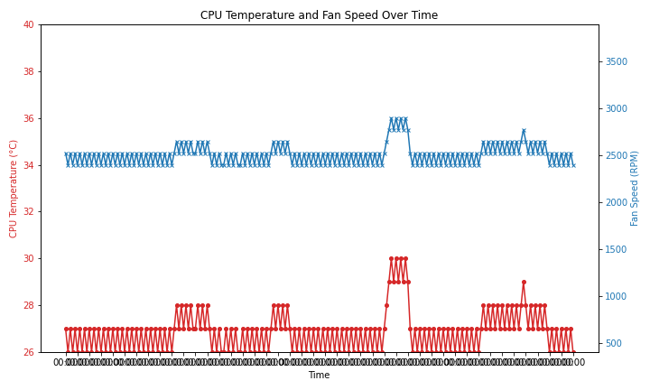

# proxmox_fan_controller




Systems supporting ipmitool can utilize this approach.

This approach has worked for me, and without buying new expensive quiet fans this will make your home-lab server quiet.

This has been tested on the Supermicro AS -E301-9D-8CN4 with Proxmox 8.3.3 (as of Jan 2025)
 
## Requirements:

- Proxmox (Deb12)
- ipmitool

## The approach

This approach relies of direct communication with the management interface to set fan speed. and it sets it on boot, and I setup a script to react to temperature change to avoid blowing it up.

## How it works?

It relies on the use of ipmitool to interact with the SuperMicro BMC (Baseboard Management Controller)

and luckily I found some people who had already pinpointed the right codes see [here](https://forums.servethehome.com/index.php?threads/help-quieting-my-supermicro-servers.39031)

Heres an example of the command which worked on my system:

```bash
ipmitool raw 0x30 0x70 0x66 0x01 0x00 0x10
```

the last digit appears to control the speed of all three fans so `0x10` might be 10%, but one of the Posters suggests `0x08` was 8% and `0x20` was full speed so you'll have to decide for yourselves.

## enable_at_boot

Refer to this document to see how you can ensure the quiet speed is set at boot.

## react_to_temp_change

Refer to this to see how Im ensuring it can speed up if it has to.

## Graphing

Theres a very simple graphing library to see how your CPU/fan speeds are going.

see data_analysis/data_analysis.py 

just put your logs into `data.txt` in the same folder or re-point the `input_file` variable.
